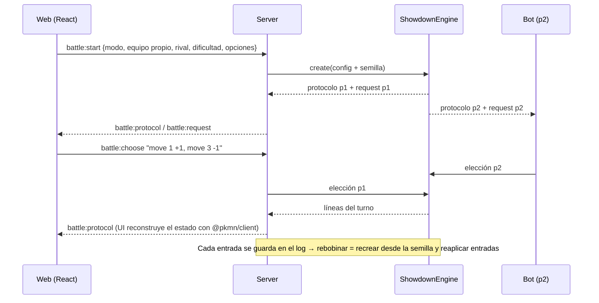

# Pokemon Colleja Simulator — Plan del proyecto

> **Estado**: Fases 0 (investigación y plan) y 1 (cimientos) completadas · 2026-10-07
> **Objetivo**: practicar combates de **Pokémon Champions** (individuales y dobles) contra un bot, con equipos propios y rivales configurables, con la máxima fidelidad a las mecánicas del juego.

Documentación de soporte:

| Doc | Contenido |
|---|---|
| [research/01-pokemon-champions.md](research/01-pokemon-champions.md) | Reglas, roster, Stat Points, cambios de mecánicas de Champions (Reg M-C) |
| [research/02-mecanicas-combate.md](research/02-mecanicas-combate.md) | Referencia de mecánicas Gen 9 (stats, daño, orden de turno, estados, clima, dobles) |
| [research/03-stack-tecnico.md](research/03-stack-tecnico.md) | Motor, librerías, calculadora, bots existentes, fuentes de datos, sprites |
| [research/anexos/](research/anexos/) | Roster completo M-C (353 entradas) y lista de objetos (166) |
| [adr/0001-motor-de-combate.md](adr/0001-motor-de-combate.md) | Decisión: envolver el simulador de Showdown |

---

## 1. Hallazgos que cambian el planteamiento

1. **Champions no tiene IVs ni EVs.** Usa **Stat Points**: 66 en total y 32 como máximo por stat, con IV fijo a 31 y nivel 50. El teambuilder reparte SP. El cálculo de stats se diseña como estrategia por formato para poder añadir más adelante un modo "clásico" con IV/EV.
2. **Pokémon Showdown ya implementa Champions** (mod `champions`, Reg M-C, con fixes semanales, MIT). Reescribir el motor costaría meses o años y sería menos fiel. **Recomendación: envolverlo** ([ADR-0001](adr/0001-motor-de-combate.md)).
3. **Hay Mega Evolución y no hay Tera.** Cambios propios de Champions: parálisis al 12,5 %, sueño de 1–2 turnos, congelación de 3 turnos como máximo, PP fijos y movimientos y habilidades rebalanceados.
4. **Formatos**: individuales con vista previa de 6 y elección de 3; dobles con vista previa de 6 y elección de 4. Rigen las cláusulas de especie y de objeto.
5. **Existe tooling listo para Champions**:
   - `@smogon/calc` (calculadora con soporte Champions), útil para el bot y para un panel de cálculo.
   - Sets "estándar" de random battle de Champions en el repo de Showdown (342 especies).
6. **Red**: este equipo filtra muchos dominios (Sophos). npm y GitHub funcionan, así que los datos y los sprites se obtienen de GitHub.

---

## 2. Alcance

### 2.1 Objetivos de la v1 (MVP)

- Crear, editar, importar y exportar **equipos propios** con validación de legalidad Champions.
- Combatir en **individuales y dobles** contra un **bot por reglas**, con varios niveles de dificultad.
- Rival con **equipo aleatorio** generado a partir de sets estándar; ese equipo se puede **editar y guardar** como preset de rival.
- Todas las mecánicas de Champions: stats, objetos, habilidades, estados, climas, campos, Megas, objetivos en dobles… Las aporta el motor.
- Interfaz en **español**.

### 2.2 Fuera de la v1 (posibles ampliaciones)

- Bot con búsqueda (lookahead o MCTS) o aprendizaje.
- Multijugador entre personas (online o local).
- Versión estática/móvil (sim en el navegador).
- Modo clásico Gen 9 (IV/EV + Tera).
- Equipos rivales sacados de estadísticas de uso reales.

---

## 3. Arquitectura

### 3.1 Principios

1. **Dominio propio, motor detrás de una interfaz.** Solo `packages/engine` conoce Showdown. El resto habla con nuestros tipos (`PokemonSet`, `Team`, `BattleConfig`, `Choice`…).
2. **Datos generados, no copiados a mano.** Un pipeline extrae snapshots JSON versionados del commit fijado de Showdown y deja una capa de *overrides* editable (sets propios, nombres).
3. **Determinismo.** Todo combate tiene semilla y registro de entradas. Así podemos reproducirlo, rebobinarlo, testearlo y guardarlo como replay.
4. **Información oculta respetada.** El bot solo ve lo que vería un jugador (stream de p2). Nunca accede al estado omnisciente.
5. **Capas con dependencias en una sola dirección**: `apps → packages`, y `core` no depende de nada del proyecto.

### 3.2 Estructura del monorepo

```
pokemon-colleja-simulator/
├─ apps/
│  ├─ web/                 # React + Vite: teambuilder, rivales, pantalla de combate
│  └─ server/              # Node + Fastify + WebSocket: sesiones de combate, API REST, persistencia
├─ packages/
│  ├─ showdown/            # ✅ Puente único y tipado hacia vendor/pokemon-showdown (Node-only)
│  ├─ core/                # Dominio puro: tipos, cálculo de stats (SP), import/export, reglas de formato
│  ├─ data/                # Snapshots JSON generados + i18n (es/en) + sets estándar + overrides
│  ├─ engine/              # Interfaz BattleEngine + adaptador ShowdownEngine (único que importa Showdown)
│  ├─ bot/                 # Estrategias del bot (aleatorio, agresivo, táctico) + elección de vista previa
│  ├─ teamgen/             # Generador de equipos aleatorios legales a partir de sets estándar
│  └─ protocol/            # Esquemas zod de los mensajes cliente↔servidor (compartidos)
├─ tools/
│  ├─ setup/               # ✅ Prepara el submódulo de Showdown (deps + build + tipos), idempotente
│  ├─ smoke/               # ✅ Combates headless deterministas entre bots aleatorios
│  ├─ data-pipeline/       # Scripts que generan packages/data desde vendor/ + PokeAPI (nombres ES)
│  ├─ arena/               # Torneos bot contra bot (métricas, búsqueda de crashes)
│  └─ cli/                 # Combate en terminal (para depurar sin UI)
├─ vendor/
│  └─ pokemon-showdown/    # Submódulo git fijado a un commit concreto
├─ storage/                # Datos del usuario: equipos, rivales, replays (JSON legibles)
├─ docs/                   # Plan, investigación, ADRs, guías
└─ assets/                 # Sprites descargados (no versionados, no se redistribuyen)
```

### 3.3 Dependencias entre módulos

```mermaid
graph LR
  web[apps/web] --> protocol
  web --> core
  web --> data
  server[apps/server] --> protocol
  server --> engine
  server --> bot
  server --> teamgen
  server --> core
  engine --> core
  engine --> bridge[packages/showdown]
  bridge -.-> vendor[(vendor/pokemon-showdown)]
  bot --> core
  bot --> data
  bot -.-> calc[(@smogon/calc)]
  teamgen --> core
  teamgen --> data
  pipeline[tools/data-pipeline] --> bridge
  pipeline --> data
  smoke[tools/smoke] --> bridge
```

**Regla dura:** solo `packages/showdown` accede a `vendor/`. Showdown se compila como CommonJS y el puente lo carga con `createRequire`, junto con sus `.d.ts`. Es Node-only: nunca se importa desde `apps/web`.

### 3.4 Flujo de un combate



### 3.5 Modelo de dominio (borrador)

```ts
type StatId = 'hp' | 'atk' | 'def' | 'spa' | 'spd' | 'spe';
type StatTable = Record<StatId, number>;

interface PokemonSet {
  species: SpeciesId;          // id de Showdown, p. ej. 'garchomp'
  nickname?: string;
  item?: ItemId;
  ability: AbilityId;
  nature: NatureId;
  statPoints: StatTable;       // Champions: ≤32 por stat, ≤66 en total
  moves: MoveId[];             // 1–4
  gender?: 'M' | 'F';
  shiny?: boolean;
}

interface Team {
  id: string;
  name: string;
  ruleset: RulesetId;          // p. ej. 'champions-regmc'
  members: PokemonSet[];       // 6
  notes?: string;
}

interface BattleConfig {
  mode: 'singles' | 'doubles';
  ruleset: RulesetId;          // se traduce a un formatid de Showdown en el adaptador
  player: Team;
  opponent: { team: Team; bot: BotLevel };
  seed?: string;
  options: { teamPreview: boolean; openTeamSheets: boolean; timer: TimerConfig | null };
}

interface BattleEngine {
  create(config: BattleConfig): BattleHandle;
}

interface BattleHandle {
  readonly id: string;
  onEvent(listener: (e: BattleEvent) => void): Unsubscribe;
  choose(side: SideId, choice: Choice): void;
  rewindTo(turn: number): void;
  exportReplay(): ReplayData;
  dispose(): void;
}
```

Mapeo de reglas a formatos de Showdown, centralizado en el adaptador:

| `mode` + `ruleset` | formatid |
|---|---|
| singles + champions-regmc | `gen9championsbssregmc` |
| doubles + champions-regmc | `gen9championsvgc2026regmc` |

Los ajustes de práctica (sin vista previa, equipo abierto…) se aplican como reglas personalizadas del formato, por ejemplo `formatid@@@!Team Preview`. Esto se verifica en la fase 3.

El adaptador **valida siempre** los dos equipos con `TeamValidator` antes de crear el combate. `BattleStream` no valida, y es el validador quien aplica `Adjust Level Down = 50` y la legalidad de Champions (comprobado en la fase 1).

### 3.6 Protocolo cliente ↔ servidor

- **REST**: `/api/teams`, `/api/opponents`, `/api/replays` (CRUD), `POST /api/teams/validate`, `POST /api/teams/random`, `GET /api/meta` (versión de datos y commit de Showdown).
- **WebSocket**:
  - Cliente → servidor: `battle:start`, `battle:choose`, `battle:rewind`, `battle:forfeit`.
  - Servidor → cliente: `battle:started`, `battle:protocol` (líneas desde la perspectiva de p1), `battle:request`, `battle:ended`, `error`.
- Todos los mensajes se validan con esquemas **zod** compartidos (`packages/protocol`).

### 3.7 Persistencia

- `storage/teams/*.json`, `storage/opponents/*.json` y `storage/replays/*.json`, todos legibles y editables a mano. Cada equipo incluye también su export de Showdown.
- Acceso a través de interfaces `TeamRepository` y `ReplayRepository`. La implementación inicial usa el sistema de archivos y puede pasar a SQLite si el proyecto crece.

---

## 4. Stack tecnológico

| Área | Elección | Motivo |
|---|---|---|
| Lenguaje | TypeScript (strict), ESM | Tipado del dominio y el mismo lenguaje que Showdown |
| Runtime | Node 24 (ya instalado) | Showdown master requiere Node ≥ 22.18 |
| Monorepo | npm workspaces | Sin herramientas extra. Los paquetes internos se consumen como fuente TS |
| Motor | Showdown vendorizado (submódulo + `node build`) | Champions al día (Reg M-C) |
| Estado del combate en cliente | `@pkmn/protocol` + `@pkmn/client` + `@pkmn/view` | Parseo del protocolo y log en texto (MIT) |
| Calculadora | `@smogon/calc` (Gen 0 = Champions) | Bot y panel de cálculo |
| Servidor | Fastify + `@fastify/websocket` + zod | Ligero, tipado y validado |
| UI | React 19 + Vite + Zustand + React Router + Tailwind CSS | Estándar, rápido de iterar |
| Tests | Vitest (unidad e integración) y Playwright (E2E, más adelante) | Rápidos y nativos de Vite |
| Lint/formato | Biome | Una sola herramienta, rápida |
| Sprites | Repo PokeAPI/sprites (`versions/generation-ix/champions/`) descargado a `assets/` | Showdown sprites está bloqueado en esta red. No se redistribuye |
| Nombres en español | CSV de PokeAPI (GitHub) → `packages/data/i18n/es.json` | Showdown solo tiene inglés |

---

## 5. Pipeline de datos (`npm run data:build`)

1. Lee el dex de Showdown con el mod `champions` del commit fijado.
2. Exporta a `packages/data/generated/`:
   - `species.json`: especies legales, formas, Megas, tipos, stats base, habilidades.
   - `moves.json`, `abilities.json`, `items.json`, `natures.json`, `learnsets.json`.
   - `formats.json`: reglas y cláusulas de cada modo.
   - `standard-sets.json`, generado desde `data/random-battles/champions/sets.json` y `doubles-sets.json`.
   - `meta.json`: SHA de Showdown, fecha y recuentos.
3. Cruza los nombres con PokeAPI y genera `i18n/es.json` y `i18n/en.json`.
4. Aplica los **overrides** de `packages/data/overrides/` (sets propios, correcciones de nombres). Es la capa donde se editarán los "sets estándar" más adelante.
5. Los tests del snapshot comprueban los recuentos (231 especies, 81–82 Megas, 166 objetos) y algunos valores concretos.

**Actualizar a una nueva regulación** = mover el submódulo → `data:build` → revisar el diff → tests → entrada en el CHANGELOG.

---

## 6. Bot

Interfaz `BotStrategy` con `chooseTeamPreview(...)` y `chooseAction(request, battleState)`. El bot solo ve la perspectiva de p2.

| Nivel | Nombre | Comportamiento |
|---|---|---|
| 0 | Aleatorio | Elección legal al azar (port de `RandomPlayerAI`). Sirve de base y para tests |
| 1 | Agresivo | Maximiza el daño esperado con `@smogon/calc`. Prioriza los KOs y usa prioridad cuando le asegura el KO. Supone el set rival a partir de los sets estándar y lo que ya se ha revelado |
| 2 | Táctico | Nivel 1 más heurísticas: cambia cuando el matchup es malo, Protección en dobles, Sorpresa en el turno 1, momento de la Mega, control de velocidad (Viento Afín y Espacio Raro), concentrar ataques en un rival, no golpear al aliado con ataques en área y movimientos de estado con valor |
| 3 | Experto (futuro) | Mira una jugada por delante (lookahead de 1 ply) clonando el combate (`Battle.fromJSON`), o MCTS con sets muestreados |

- **Vista previa**: puntúa cada matchup (tipos, velocidad, amenazas) para elegir sus 3 o 4.
- **Arena** (`tools/arena`): torneos bot contra bot con N combates. Mide el porcentaje de victorias y detecta elecciones inválidas o cuelgues.
- **Modo explicación** (fase 8): el bot puede mostrar por qué eligió su jugada, lo que también sirve para aprender.

---

## 7. Pantallas de la UI

1. **Inicio**: elegir modo (individuales/dobles), tu equipo y el rival (aleatorio, preset o equipo pegado), y la dificultad.
2. **Teambuilder**:
   - Lista de equipos.
   - Editor de cada Pokémon: buscador de especies, habilidad, objeto (con Item Clause), naturaleza, **SP con stats en vivo**, movimientos filtrados por learnset y validación en vivo.
   - Importar y exportar texto de Showdown.
3. **Rivales**: generar un equipo aleatorio, editarlo en el teambuilder y guardarlo como preset con su dificultad.
4. **Combate**:
   - Vista previa (6 → 3/4).
   - Campo con sprites, barras de PS (exactos los propios, % los del rival) y estado.
   - Panel de clima, campo, pantallas y peligros.
   - Selector de movimiento, objetivo (dobles) y Mega.
   - Log en español.
5. **Herramientas** (fase 8): calculadora, rebobinar turno, replays, ver el equipo rival completo y explicación del bot.

---

## 8. Hoja de ruta

Tamaños orientativos: S (pocas sesiones) · M · L.

| Fase | Tamaño | Entregable | Hecho cuando… |
|---|---|---|---|
| **0. Investigación y plan** | — | Esta documentación | ✅ |
| **1. Cimientos** ✅ | S | `git init`, monorepo, TS/Biome/Vitest, submódulo de Showdown fijado y compilado, CLAUDE.md del proyecto | ✅ `npm run smoke`: 22 combates (fixtures VGC/BSS + aleatorios) sin errores. 14 tests, deterministas por semilla |
| **2. Datos** | M | Pipeline de datos, i18n ES, sets estándar, overrides, script de descarga de sprites | Snapshot generado con `meta.json`, y los tests de recuentos y valores pasan |
| **3. Dominio + motor** | M | `core` (stats SP, import/export, validación) y `engine` (BattleEngine, sesión, semillas, rebobinar). CLI para jugar en terminal | **Primer combate jugable** (en terminal). Misma semilla + mismas entradas = mismo log |
| **4. Bot** | M | Niveles 0–2, elección en vista previa, `teamgen`, arena | El nivel 2 gana al menos el 80 % de 500 combates contra el nivel 0 en cada modo, sin elecciones inválidas |
| **5. Servidor + UI de combate** | L | Fastify + WS, app React, pantalla de combate de individuales y luego de dobles. Importación de equipo pegado | Combate completo en el navegador en ambos modos |
| **6. Teambuilder** | L | Editor completo con SP, validación y persistencia | Crear un equipo legal desde cero y usarlo en combate |
| **7. Rivales editables** | S–M | Generar, editar y guardar rivales; elegir rival y dificultad | Practicar contra un equipo concreto guardado |
| **8. Herramientas de práctica** | M | Calculadora, rebobinar, replays, equipo abierto, explicación del bot | — |
| **Futuro** | — | Bot nivel 3, modo clásico IV/EV/Tera, PWA/móvil, PvP, rivales basados en uso real | — |

**MVP = fases 1–5.** Al terminar la fase 5 ya se puede practicar pegando un equipo de Showdown. Las fases 6–7 completan la experiencia que pediste.

---

## 9. Estrategia de testing

| Capa | Qué se testea |
|---|---|
| `core` | Cálculo de stats con SP frente a valores conocidos de Showdown y de la calculadora. Ida y vuelta de import/export. Reglas de formato |
| `data` | Recuentos y legalidad del snapshot. Muestras puntuales (stats base, cambios de movimientos de Champions) |
| `engine` | Determinismo por semilla. Logs de referencia de combates guionizados. Rebobinado correcto. Traducción de elecciones (objetivos en dobles, Mega) |
| `bot` | Fuzzing: miles de combates bot contra bot sin elecciones inválidas ni cuelgues. Porcentaje de victorias por nivel |
| `server` / `web` | Esquemas del protocolo. Componentes críticos (selector de objetivo, editor de SP). E2E con Playwright más adelante |

Las mecánicas en sí **no se re-testean**: son responsabilidad del motor (Showdown tiene 359 ficheros de test propios). Solo se comprueba nuestra integración con él.

---

## 10. Convenciones

- **Código en inglés** (identificadores, comentarios técnicos). **Docs y UI en español.**
- TypeScript `strict`, sin `any` y con exports con nombre. Ficheros en `kebab-case`, tipos en `PascalCase`.
- Una responsabilidad por módulo. Lógica pura en `core`/`bot`/`teamgen`; los efectos (red, disco, procesos) van en `apps/*` y en los adaptadores.
- **ADR** (`docs/adr/NNNN-titulo.md`) para cada decisión de arquitectura relevante.
- **CHANGELOG.md** con cada fase y cada actualización de datos o regulación.
- Commits con *Conventional Commits* (`feat(bot): …`, `fix(engine): …`, `chore(data): bump showdown to <sha>`).

---

## 11. Riesgos

| Riesgo | Mitigación |
|---|---|
| Cambios de API o protocolo de Showdown al actualizar el commit | Adaptador único, tests de integración y actualizaciones deliberadas |
| `@pkmn/client` va con datos de Champions de junio (le faltan las Megas de M-C) | Comprobarlo al principio de la fase 3. Plan B: alimentar el cliente con nuestro dex generado |
| Filtro de red (Sophos) | Usar solo npm y GitHub. Sprites y nombres desde repos de GitHub |
| Licencias: el arte es © Nintendo/TPC, y los sets de Smogon tienen copyright | Uso personal, assets fuera de git, sets base desde el repo MIT de Showdown |
| Crecimiento del alcance | MVP cerrado (fases 1–5) y el resto planificado por fases |
| Fidelidad en casos raros de Champions | Depende de la investigación de Showdown. Reportar o parchear vía overrides si hiciera falta |

---

## 12. Decisiones tomadas (2026-10-07)

| # | Tema | Decisión |
|---|---|---|
| 1 | Motor | **Envolver el sim de Showdown** con el mod `champions`, fijado a un commit ([ADR-0001](adr/0001-motor-de-combate.md)) |
| 2 | Plataforma | **App web local + servidor Node** (`npm run dev`). La web estática y el móvil quedan como evolución futura (variante A2) |
| 3 | Stats | **Solo Stat Points** de Champions. El modo clásico IV/EV/Tera queda como ampliación futura, con el cálculo de stats ya preparado como estrategia por formato |
| 4 | Idioma | **Español por defecto con selector de inglés** para los nombres de Pokémon, movimientos, objetos y habilidades |
